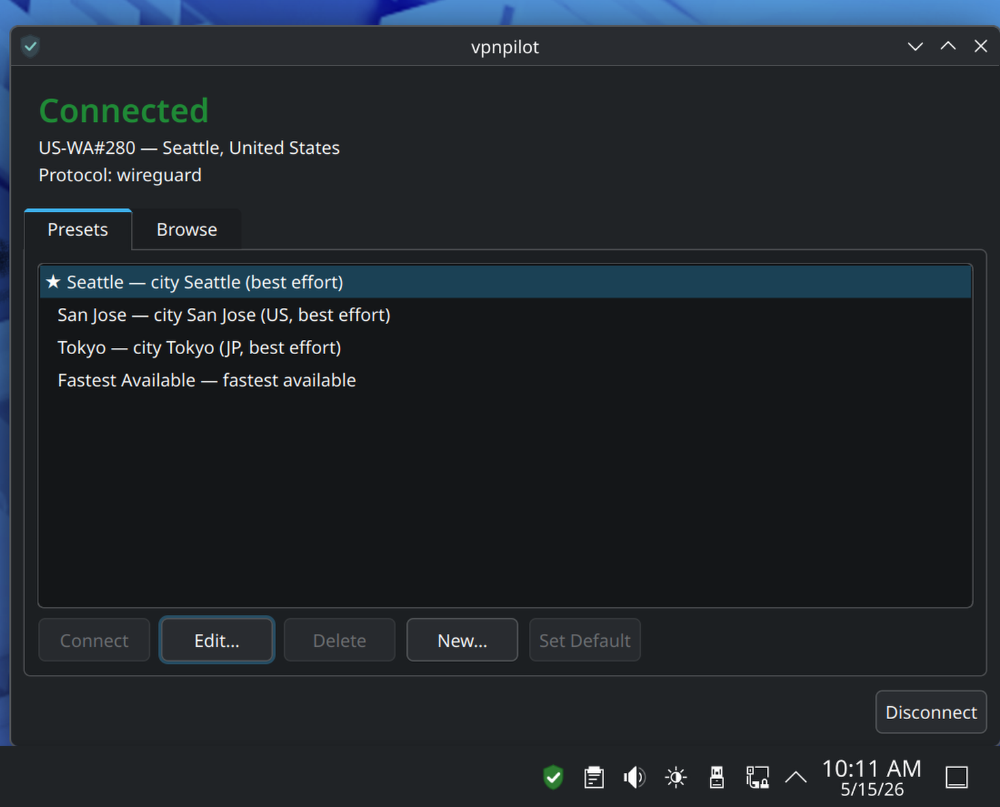
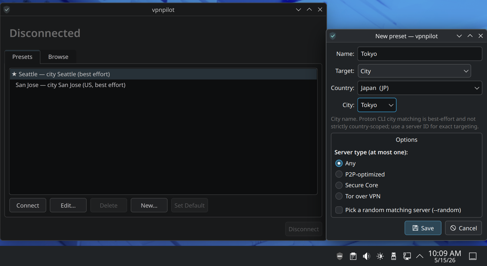
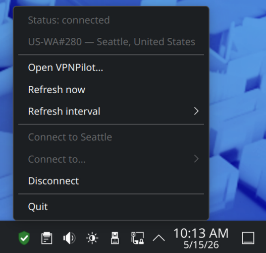

# VPNPilot

VPNPilot is an unofficial third-party Linux desktop tray app for managing a Proton VPN connection.

It can wrap the official `protonvpn` CLI, or control an imported Proton OpenVPN profile through NetworkManager, and provides a small desktop UI for connection status, presets, country/city browsing, sign-in state, and common connect/disconnect actions.

Repository: https://github.com/tiffany98101/vpnpilot

> [!IMPORTANT]
> VPNPilot is not affiliated with, endorsed by, or supported by Proton AG. It does not replace Proton VPN's official Linux client and does not use Proton branding.

## Screenshots

<p align="center">
  
  
</p>

<p align="center">
  
  
</p>

## Current Features

- System tray UI with connection and authentication indicators
- Connect and disconnect actions from the tray
- Modeless main window with a connection status panel
- Editable preset library
- Country/city server browser backed by Proton VPN CLI catalog data
- Sync Servers button that refreshes the shared Proton VPN server catalog without changing the active VPN connection
- Optional NetworkManager OpenVPN backend for manually imported Proton profiles
- Sign-in helper panel that copies `protonvpn signin <email>` and rechecks auth state
- Troubleshooting/setup-help dialog with Copy Diagnostic Info and Open Log actions
- Single-instance lock to prevent duplicate tray icons
- `vpnpilot catalog dump` diagnostic command

## Requirements

- Linux desktop with a working system tray
- Fedora KDE Plasma tested
- GNOME users need AppIndicator support
- Official Proton VPN Linux CLI installed and signed in (`protonvpn`) for the default Proton CLI backend
- NetworkManager tools (`nmcli`)
- systemd resolver tools (`resolvectl`) for DNS diagnostics
- Python 3.12+
- PyQt6

Do not run the official Proton VPN GUI app and the Proton VPN CLI at the same time.

## Installation

### Normal install from git clone

The repository includes a prebuilt VPNPilot RPM under `dist/rpm/`, so normal users do not need to build the RPM, install RPM build tools, use pip, or run from source.

```sh
git clone https://github.com/tiffany98101/vpnpilot.git
cd vpnpilot
sudo dnf install ./dist/rpm/vpnpilot-*.rpm
```

Or use the wrapper script:

```sh
./scripts/install-rpm.sh
```

The VPNPilot RPM declares Proton VPN's official Linux CLI package, `proton-vpn-cli`, as a runtime dependency. If `dnf` cannot find `proton-vpn-cli`, install Proton's Fedora repository and CLI first, then retry the VPNPilot install:

```sh
./scripts/install-protonvpn-cli-fedora.sh
sudo dnf install ./dist/rpm/vpnpilot-*.rpm
```

Then sign in with your own Proton VPN account:

```sh
protonvpn signin you@example.com
```

Do not copy someone else's Proton VPN credentials, tokens, profiles, or local configuration.

GitHub Releases also provide RPM/SRPM files for tagged builds.

### Build the RPM locally from source

This path is for maintainers and developers only:

```sh
git clone https://github.com/tiffany98101/vpnpilot.git
cd vpnpilot
./scripts/build-rpm.sh
sudo dnf install ~/rpmbuild/RPMS/noarch/vpnpilot-*.rpm
```

The package is currently `noarch`; if that changes later, install from the matching architecture directory under `~/rpmbuild/RPMS/`.

For a local review build from an uncommitted checkout, use the Makefile target:

```sh
make rpm
sudo dnf install ./dist/vpnpilot-*.rpm
```

`make rpm` builds the source tarball from tracked files in the current working tree, so it can be used to validate a pull request before committing. It writes the installable RPM to `dist/` and uses `.rpmbuild/` as repo-local scratch space. The release helper `./scripts/build-rpm.sh` is still the CI/tag-build path and writes RPM/SRPM artifacts under `~/rpmbuild/`.

To uninstall VPNPilot:

```sh
sudo dnf remove vpnpilot
```

### Developer install

Use the editable install flow only for development and testing from a checkout:

```sh
git clone https://github.com/tiffany98101/vpnpilot.git
cd vpnpilot

python3 -m venv .venv
source .venv/bin/activate

pip install --upgrade pip wheel
pip install -e .
vpnpilot
```

If the script entry point is not on your shell path, run it from the project directory:

```sh
python -m vpnpilot
```

## Developer setup

```sh
git clone https://github.com/tiffany98101/vpnpilot.git
cd vpnpilot

make install-dev
make run
```

Useful dev commands:

```sh
make test
make lint
make clean
```

## Local KDE launcher install for testing

For Fedora/KDE testing from a checkout, install a user-local launcher, desktop file, icon, and AppStream metadata:

```sh
make install-dev
scripts/install-local.sh
```

Then start VPNPilot from the KDE application launcher, or run:

```sh
vpnpilot
```

To remove only the files installed by the local test installer:

```sh
scripts/uninstall-local.sh
```

## First-time setup

Install Proton VPN's official Linux CLI first and sign in there before using VPNPilot. RPM installs declare `proton-vpn-cli` as a dependency, but your system must have access to Proton's Fedora repository for dnf to resolve it.

Check that the CLI is available:

```sh
command -v protonvpn
protonvpn --help
```

Sign in with Proton VPN CLI:

```sh
protonvpn signin you@example.com
```

Check Proton VPN CLI status:

```sh
protonvpn status
```

Then start VPNPilot:

```sh
vpnpilot
```

## Using a manual Proton OpenVPN NetworkManager profile

VPNPilot can use an imported NetworkManager OpenVPN profile instead of calling `protonvpn connect`. This is useful on systems where the official Proton VPN Linux CLI/app is unreliable or its kill-switch path interferes with routing or DNS.

Import the Proton OpenVPN profile:

```sh
nmcli connection import type openvpn file ~/Documents/us-dc-281.protonvpn.tcp.ovpn
```

Manual Proton OpenVPN profiles use Proton's OpenVPN/IKEv2 username and password from the Proton VPN account settings. They do not use the normal Proton account password. VPNPilot does not store VPN passwords, OpenVPN credentials, Proton credentials, tokens, or `.ovpn` file contents.

Configure VPNPilot to use the imported profile:

```sh
vpnpilot backend set \
  --backend networkmanager-openvpn \
  --networkmanager-profile us-dc-281.protonvpn.tcp
```

The same setting can be written by editing `~/.config/vpnpilot/settings.json`:

```json
{
  "backend": "networkmanager-openvpn",
  "networkmanager_profile": "us-dc-281.protonvpn.tcp",
  "prefer_active_nm_vpn": true,
  "nmcli_timeout_seconds": 20,
  "version": 1
}
```

You can verify or connect the profile directly:

```sh
nmcli connection up us-dc-281.protonvpn.tcp
vpnpilot backend status
```

Backend choices are:

- `auto`: prefer an active NetworkManager VPN; prefer the configured NetworkManager profile when it exists; otherwise use the Proton CLI.
- `proton-cli`: keep the original `protonvpn` CLI behavior.
- `networkmanager-openvpn`: use `nmcli connection up/down <profile>`.

This mode bypasses the official Proton CLI/app kill-switch path. VPNPilot intentionally does not manage Proton's `pvpn-killswitch` or `pvpnksintrf0` interfaces, and it does not delete NetworkManager profiles.

Troubleshooting commands:

```sh
nmcli connection show --active
ip route
resolvectl status
curl -4 https://ifconfig.me
```

## Basic usage

1. Start `vpnpilot`.
2. Use the tray icon to check VPN/auth state.
3. Open the main window for details, presets, and the country/city browser.
4. Create or edit presets for common locations.
5. Use `Sync Servers` when you want to refresh the country/city catalog without connecting, disconnecting, or changing the active VPN.
6. Use Connect/Disconnect from the tray or main UI.
7. If something fails, open `Troubleshooting / Setup Help` from the tray.

City targeting depends on Proton CLI `--city` behavior. VPNPilot stores country and city context in presets for clarity, but city connects are still best-effort unless you use an exact server ID.

## Diagnostics

Runtime logs are written to:

```text
~/.local/state/vpnpilot/vpnpilot.log
```

Use the tray menu's `Copy Diagnostic Info` action to copy a redacted diagnostic report to the clipboard. It includes app version, Python/platform details, selected desktop session variables, Proton VPN CLI status, NetworkManager active connections and VPN profiles, interface summary, default route, DNS status, and the last app-level error when available.

Dump the Proton VPN CLI catalog data used by VPNPilot:

```sh
vpnpilot catalog dump
```

The main-window `Sync Servers` button refreshes the same in-memory catalog used by the Browse tab and preset editor. It does not run a VPN connect or disconnect command. If a refresh cannot start or the Proton VPN CLI cannot provide countries, the Browse tab re-enables its refresh controls and shows the failure hint.

Check NetworkManager:

```sh
systemctl status NetworkManager --no-pager
```

Check Proton VPN CLI directly:

```sh
protonvpn status
```

## Scope and security notes

VPNPilot is a UI wrapper around Proton VPN's official CLI or an existing NetworkManager VPN profile.

It does **not** implement VPN tunneling, WireGuard/OpenVPN handling, kill switch policy, DNS leak protection, split tunneling, or VPN security controls on its own.

It should not need elevated privileges. VPN operations are delegated to Proton VPN CLI, NetworkManager, and the system services those tools already use.

## Known limitations

- Desktop tray behavior varies by desktop environment. Fedora KDE is the primary target.
- Proton VPN CLI text output is parsed best-effort and may change between CLI releases.
- VPNPilot should not be run at the same time as the official Proton VPN GUI.
- The NetworkManager backend controls already-imported profiles; it does not import `.ovpn` files or manage credentials.
- The local install script is for developer testing, not a system package manager replacement.

## Project status

This project is early/alpha software. Expect rough edges, especially around desktop tray behavior, keyring integration, and Proton VPN CLI behavior changes.

Feedback from Fedora/KDE and Proton VPN Linux users is welcome.

## Development notes

See `CLAUDE.md` for architecture, the CLI abstraction, the detection strategy, and packaging notes.
